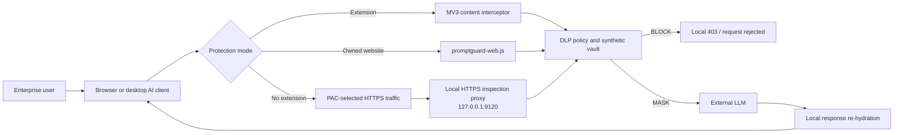

# 🛡️ PromptGuard Gateway

<div align="center">

[](https://react.dev/)
[](https://www.typescriptlang.org/)
[](https://vitejs.dev/)
[](https://tailwindcss.com/)
[](https://developer.chrome.com/docs/extensions/mv3/intro/)
[](https://github.com/gturkmenlabs/PromptGuard-Gateway)

<p align="center">
  <strong>Enterprise Zero-Knowledge Data Loss Prevention (DLP) & Security Gateway for Generative AI & LLMs</strong>
</p>

<p align="center">
  Intercept, anonymize, and cryptographically audit enterprise prompts in real-time before sensitive PII, PHI, API keys, credentials, or proprietary source code reach third-party AI models (ChatGPT, Claude, Gemini, Copilot).
</p>

</div>

---

## 📑 Table of Contents

- [Overview](#-overview)
- [Key Features](#-key-features)
- [Architecture & Data Flow](#-architecture--data-flow)
- [Supported Protection Categories](#-supported-protection-categories)
- [Modules & Subsystems](#-modules--subsystems)
- [Chrome / Edge Extension](#-chrome--edge-extension)
- [Extension-Free HTTPS Protection](#-extension-free-https-protection)
- [Verification & Troubleshooting](#-verification--troubleshooting)
- [Docker](#-docker)
- [Quick Start Guide](#-quick-start-guide)
- [Security & Compliance](#-security--compliance)
- [Contributing](#-contributing)
- [License](#-license)

---

## 🌟 Overview

As enterprises accelerate the adoption of Generative AI tools (e.g., ChatGPT, Anthropic Claude, Google Gemini, GitHub Copilot), employees inadvertently leak critical organizational assets:
* **Customer PII & Financial Records**
* **HIPAA/PHI Healthcare Information**
* **Cloud API Keys, SSH Certificates & Database Passwords**
* **Proprietary Core Algorithms & Source Code**

**PromptGuard Gateway** sits between enterprise users and external AI endpoints. It can run as
a browser extension, an extension-free local HTTPS inspection proxy, an OpenAI-compatible API
gateway, or an embeddable Web SDK. Sensitive entities are replaced with synthetic tokens before
the request reaches an LLM and can be restored locally in the corresponding response.

---

## ✨ Key Features

### 1. 🔒 Zero-Knowledge Synthetic Vault
- **Context-Aware Replacement:** Replaces real names, emails, credit cards, and API keys with semantically valid synthetic data (e.g., `sk-live-...` $\rightarrow$ `synthetic-token-4912`).
- **Local-Only Vaulting:** Token mappings remain in volatile memory inside the browser or local daemon and are not written to audit logs.
- **Bi-Directional Re-hydration:** Automatically maps synthetic tokens back to original values in the corresponding LLM response.

### 2. ⚡ Live Proxy Simulator
- Interactive real-time interceptor showing the 4-stage pipeline:
  1. **Raw Enterprise Prompt**
  2. **Entity Tokenization & Policy Engine**
  3. **Sanitized Synthetic Payload sent to LLM**
  4. **Unmasked Final Response**
- Live attack wave generator for red-team testing and CISO demonstrations.

### 3. 📊 CISO Threat Intelligence & Risk Dashboard
- Real-time telemetry on intercepted leaks, high-risk departments, and top targeted AI services.
- Live attack and data-leak stream with instant enforcement actions (**Mask**, **Block**, **Hash**, **Log Only**).
- Departmental risk scoring (Engineering, HR, Finance, Legal, Customer Support).

### 4. 📜 Merkle-Proof Cryptographic Audit Logs
- Tamper-evident, zero-knowledge audit trails for all prompt transactions.
- Every record is committed twice over: an append-only **hash chain**
  (`entryHash = SHA-256(prevHash ‖ leafHash)`) proves ordering, and a **Merkle tree**
  gives auditors an inclusion proof for a single record against the published root
  without exposing any other record.
- Hashing is real `SHA-256` via WebCrypto, with RFC 6962-style domain separation
  between leaves and inner nodes. Only the **digest** of a prompt is committed —
  never the prompt itself.
- The audit view recomputes the root and re-verifies the whole chain live; editing
  a committed record surfaces as `TAMPERING DETECTED at sequence #n`.

### 5. ⚖️ Compliance & Governance Suite
- Automated compliance verification matrix for **SOC2 Type II**, **GDPR**, **HIPAA**, **ISO 27001**, and **PCI-DSS**.
- Printable auditor dossier quoting the ledger's live Merkle root, record count and chain status.
- Evidence exports: CSV audit trail (audit tab, includes prompt digests, chain hashes and the root) and JSON ledger export (extension popup).

### 6. 🚀 Enterprise MDM & Zero-Touch Deployment
- Ready-to-deploy configuration profiles and deployment scripts:
  - **Microsoft Intune** (`.ps1` PowerShell enrollment)
  - **Jamf Pro** (`.mobileconfig` for macOS fleet)
  - **Windows Group Policy (GPO)** (`.admx` force-install policies)
  - **Enterprise PAC & Network Proxy** configurations

### 7. 💰 Financial ROI & Breach Risk Calculator
- Interactive financial model calculating estimated breach avoidance savings, compliance penalty mitigation, and enterprise ROI based on organization headcount.

---

## 🏛️ Architecture & Data Flow



The administration service on `127.0.0.1:9119` serves the health endpoint, PAC file,
local CA certificate, Web SDK and production dashboard. The HTTPS inspection listener is
separate and bound to loopback port `9120`.

---

## 🛡️ Supported Protection Categories

| Category | Detectable Entities | Default Action | Supported Regs |
| :--- | :--- | :---: | :--- |
| **API Keys & Secrets** | AWS Keys, OpenAI/Anthropic/Google Keys, GitHub PATs, Private Keys, DB URIs | `BLOCK` | SOC2, ISO 27001 |
| **Bearer Tokens** | JWTs, inline `password:` / `token=` assignments | `MASK` | SOC2, ISO 27001 |
| **Personal Data (PII)** | Names, Emails, Phone Numbers, SSNs, Physical Addresses | `SYNTHESIZE` | GDPR, CCPA |
| **Financial Info** | Credit Card Numbers (Luhn), IBANs, Bank Routing Codes | `MASK` | PCI-DSS |
| **Healthcare (PHI)** | Patient IDs, Medical Record Numbers, Diagnosis Terms | `MASK` | HIPAA |
| **Source Code & IP** | Proprietary algorithms, Internal DB Schemas, Confidential URLs | `BLOCK / MASK` | Corporate IP |

---

## 🧩 Modules & Subsystems

```
PromptGuard-Gateway/
├── 📁 daemon/                     # Local admin service and HTTPS inspection proxy
│   ├── server.mjs                 # Ports 9119/9120, PAC, CA, scan and gateway APIs
│   └── 📁 installer/              # macOS, Windows and Linux installers
├── 📁 extension/                  # Chrome & Edge Manifest V3 Extension
│   ├── manifest.json              # Extension manifest & permissions
│   ├── promptguard-core.js        # Shared detection rules, masking & policy decisions
│   ├── content_script.js          # MAIN-world fetch/XHR proxy + on-page UI
│   ├── bridge.js                  # ISOLATED-world relay to the service worker
│   ├── background.js              # Hash-chained audit ledger (chrome.storage)
│   ├── popup.html                 # Extension quick-action control popup
│   └── popup.js                   # Ledger status, counters & auditor export
├── 📁 src/
│   ├── 📁 components/
│   │   ├── 📁 simulator/          # Live Proxy Interceptor & Sandbox
│   │   ├── 📁 dashboard/          # CISO Executive Threat Dashboard
│   │   ├── 📁 policies/           # Granular Policy Management Hub
│   │   ├── 📁 audit/              # Merkle-Proof Audit Log Viewer
│   │   ├── 📁 compliance/         # Regulatory Compliance Suite
│   │   ├── 📁 deployment/         # MDM / GPO Deployment Script Hub
│   │   ├── 📁 roi/                # ROI & Cost Avoidance Calculator
│   │   └── 📁 layout/             # Navigation & Header Components
│   ├── 📁 engine/
│   │   ├── tokenEngine.ts         # Regex & heuristic entity extractor
│   │   ├── syntheticVault.ts      # Contextual synthetic entity generator
│   │   └── cryptoAudit.ts         # SHA-256 hasher & Merkle proof builder
│   ├── 📁 data/                   # Initial security metrics & seed data
│   ├── 📁 types/                  # Core TypeScript types & interfaces
│   ├── App.tsx                    # Main gateway portal
│   └── main.tsx                   # React root entrypoint
├── 📁 public/
│   ├── promptguard-web.js         # Zero-extension SDK for websites you control
│   └── demo-chat.html             # OpenAI-compatible gateway demo
├── Dockerfile
└── docker-compose.yml
```

---

## 🔌 Chrome / Edge Extension

The project includes an **Enterprise Chrome & Edge Manifest V3 Extension** located in the [`/extension`](./extension) folder.

### Installing Extension in Developer Mode:
1. Open Chrome/Edge and navigate to `chrome://extensions/` or `edge://extensions/`.
2. Toggle on **Developer mode** (top right corner).
3. Click **"Load unpacked"** (*Paketlenmemiş öge yükle*).
4. Select the `PromptGuard Gateway/extension` folder.
5. The PromptGuard shield icon will appear in your browser toolbar, automatically protecting your sessions on ChatGPT, Claude, and Gemini.

### Enforcement behaviour
- **Blocked categories** (standing credentials: cloud/API keys, GitHub PATs, private keys,
  database URIs) stop the outbound request entirely — `fetch` rejects and `XHR` aborts, so
  the payload never reaches the network. The user sees why, and is told to rotate the key.
- **Masked categories** (PII, PHI, financial figures, proprietary code and hosts) are
  replaced with synthetic tokens on the wire and re-hydrated in the streamed response.
- Every intercept appends a record to the service-worker ledger. Only a `SHA-256` digest of
  the payload is stored; the popup shows the chain status and exports the ledger as JSON.

## 🌐 Extension-Free HTTPS Protection

PromptGuard can protect supported AI websites without modifying those websites and without
installing a browser extension. The desktop daemon uses two local listeners:

| Listener | Purpose | Exposure |
| :--- | :--- | :--- |
| `127.0.0.1:9119` | Dashboard, health API, PAC file, CA download, Web SDK and OpenAI-compatible API | Loopback only by default |
| `127.0.0.1:9120` | HTTPS inspection proxy | Loopback only by default |

The default PAC configuration covers every model served through these provider families:

- OpenAI/ChatGPT, Anthropic/Claude, Gemini/Vertex AI and Azure OpenAI
- Amazon Bedrock, Microsoft Copilot, Mistral, Groq and Cohere
- Perplexity, Together AI, OpenRouter, DeepSeek, xAI/Grok and Fireworks AI
- Hugging Face Inference Router, Replicate, Cerebras and DeepInfra
- Poe, Character.AI, Meta AI, Cursor and Ollama Cloud
- Local Ollama (`11434`) and LM Studio (`1234`) endpoints

Protection is based on the request route, not the model name. For example, every current or
future model selected through `api.openrouter.ai` is covered without adding its model ID.

### Add any LLM provider or private gateway

Append comma-separated domains with `PROMPTGUARD_DOMAINS`. Exact domains and single-label
wildcards are supported; a global `*` is rejected so unrelated HTTPS traffic is never silently
intercepted.

```bash
# Temporary/direct daemon launch
PROMPTGUARD_DOMAINS="llm.company.internal,*.models.example.com" \
  node daemon/server.mjs

# Persist on macOS or Linux by passing the setting to the installer
PROMPTGUARD_DOMAINS="llm.company.internal,*.models.example.com" \
  bash daemon/installer/install-macos.sh
```

On Windows, persist the setting before rerunning the installer:

```powershell
setx PROMPTGUARD_DOMAINS "llm.company.internal,*.models.example.com"
daemon\installer\install-windows.bat
```

For additional local OpenAI-compatible servers, provide their loopback ports separately:

```bash
PROMPTGUARD_LOCAL_LLM_PORTS="8080,5001" node daemon/server.mjs
```

Restart the daemon and browser after changing either setting. The active domain patterns and
local ports are exposed by `/health` as `protectedDomains`, `customDomains` and
`protectedLocalPorts`.

All other destinations use a direct connection. For selected domains, ordinary page assets
and responses pass through unchanged. PromptGuard buffers only textual `POST`, `PUT` and
`PATCH` request bodies before forwarding them. A request containing a blocked pattern never
sends body bytes upstream; a request larger than the 5 MiB inspection limit fails closed.
Text WebSocket messages are also scanned and re-hydrated, while binary frames pass through
unchanged.

### Desktop installation

Install dependencies first, then run the installer for your platform:


```bash
npm install

# macOS
bash daemon/installer/install-macos.sh

# Linux
bash daemon/installer/install-linux.sh
```

On Windows, run `daemon\installer\install-windows.bat`. The installers:

1. Register the daemon to start with the user session.
2. Generate a device-local CA under `~/.promptguard/ca` (Windows:
   `%USERPROFILE%\.promptguard\ca`).
3. Add that CA to the platform trust store.
4. Enable `http://127.0.0.1:9119/proxy.pac` as the automatic proxy configuration.

> A PAC setting alone is not DLP inspection. HTTPS prompt bodies remain encrypted unless the
> device-local CA is explicitly trusted.

The CA private key remains in `~/.promptguard/ca` and the proxy listens on loopback by
default. Do not copy that private key or expose port `9120` to another machine. Applications
that use certificate pinning may reject HTTPS inspection and must use an explicit
OpenAI-compatible gateway endpoint or the Web SDK instead.

For websites you own, the CA is unnecessary: embed
`http://127.0.0.1:9119/promptguard-web.js` in the page to use client-side `fetch` interception.
Third-party pages cannot load this SDK unless their source is changed; use the HTTPS proxy
mode for those pages.

---

## ✅ Verification & Troubleshooting

### Check daemon and CA readiness

```bash
curl http://127.0.0.1:9119/health
```

A ready installation returns values equivalent to:

```json
{
  "status": "active",
  "port": "9119",
  "proxyPort": 9120,
  "caReady": true,
  "mode": "https-inspection",
  "protectedDomainCount": 34,
  "customDomains": [],
  "protectedLocalPorts": ["11434", "1234"]
}
```

Confirm the PAC response:

```bash
curl http://127.0.0.1:9119/proxy.pac
```

On macOS, confirm that the active network service uses it:

```bash
networksetup -getautoproxyurl "Wi-Fi"
```

### ChatGPT shows “Something went wrong”

1. Confirm that both ports are listening and `/health` reports `caReady: true`.
2. Restart the daemon:

   ```bash
   launchctl kickstart -k gui/$(id -u)/io.promptguard.gateway
   ```

3. Reload ChatGPT with `Cmd + Shift + R`, or fully quit and reopen the browser.
4. Inspect `/tmp/promptguard-daemon.err` for new errors.

The proxy accepts request and upstream response headers up to 64 KiB. ChatGPT cookies and
Gemini CSP/reporting headers can both exceed Node.js's 16 KiB defaults in opposite directions.
The proxy also avoids JSON reserialization, forced chunking and response transforms when no
sensitive token was created.

### Common failure modes

| Symptom | Likely cause | Resolution |
| :--- | :--- | :--- |
| Browser reports an untrusted certificate | Local CA is not trusted | Run the platform installer again and restart the browser |
| `/health` does not respond | Daemon is stopped or port `9119` is occupied | Check the service log and stop the conflicting process/container |
| Gemini does not open and logs show `PROXY_TO_SERVER_REQUEST_ERROR: Header overflow` | Upstream Google response headers exceeded the parser limit | Update/restart the daemon; current builds allow a finite 64 KiB in both directions |
| PAC works but prompts are not counted | Browser cached old proxy settings or request is outside the supported domain list | Restart the browser and inspect `/proxy.pac` |
| A pinned desktop application refuses connections | Certificate pinning rejects local HTTPS inspection | Use the explicit API gateway or embedded Web SDK |
| Docker and desktop daemon cannot start together | Both try to bind ports `9119` and `9120` | Run only one deployment mode at a time |

---

## 🐳 Docker

Build and start the production dashboard, API and HTTPS proxy:

```bash
docker compose up -d --build
docker compose logs -f
```

Compose publishes both ports on `127.0.0.1` and persists the generated CA in the
`promptguard-ca` volume. Browser HTTPS inspection still requires downloading
`http://127.0.0.1:9119/ca.pem`, trusting it on the host OS, and enabling the PAC URL.
Do not run the Docker deployment at the same time as the desktop LaunchAgent/systemd service.

Stop the Docker deployment with:

```bash
docker compose down
```

---

## 🚀 Quick Start Guide

### Prerequisites
- **Node.js**: v18.0.0 or higher
- **npm** or **pnpm** or **yarn**

### Installation

1. **Clone the repository:**
   ```bash
   git clone https://github.com/gturkmenlabs/PromptGuard-Gateway.git
   cd PromptGuard-Gateway
   ```

2. **Install dependencies:**
   ```bash
   npm install
   ```

3. **Start the frontend development server:**
   ```bash
   npm run dev
   ```

   This starts only the Vite dashboard. To run the local gateway and HTTPS proxy directly:

   ```bash
   node daemon/server.mjs
   ```

4. **Build for production:**
   ```bash
   npm run build
   ```

5. **Linting:**
   ```bash
   npm run lint
   ```

---

## 🔒 Security & Compliance Principles

- **Zero-Storage of Raw Prompts:** Raw prompts containing clear-text credentials or PII are never persisted to disk or cloud logs.
- **Client-Side Cryptography:** Audit logs store only cryptographic nonces and hashes ($SHA-256$) to provide non-repudiation and proof of compliance without creating secondary data leak vectors.
- **Fail-Secure Architecture:** If the gateway loses connectivity to policy servers or encounters an unhandled exception, it defaults to blocking high-risk payloads.

---

## 🤝 Contributing

Contributions, bug reports, and feature requests are welcome!

1. Fork the repository
2. Create your feature branch (`git checkout -b feature/AmazingFeature`)
3. Commit your changes (`git commit -m 'feat: Add some AmazingFeature'`)
4. Push to the branch (`git push origin feature/AmazingFeature`)
5. Open a Pull Request

---

## 📄 License

This project is licensed under the MIT License. See the [LICENSE](./LICENSE) file for details.

---

<div align="center">
  <sub>Built with ❤️ by <a href="https://github.com/gturkmenlabs">Gökhan Türkmen</a> for Enterprise AI Security.</sub>
</div>
