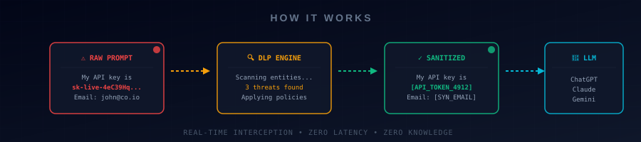
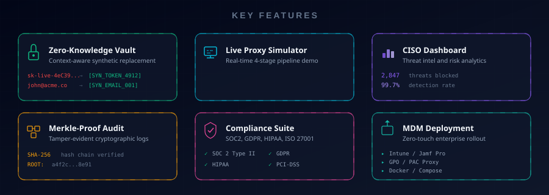
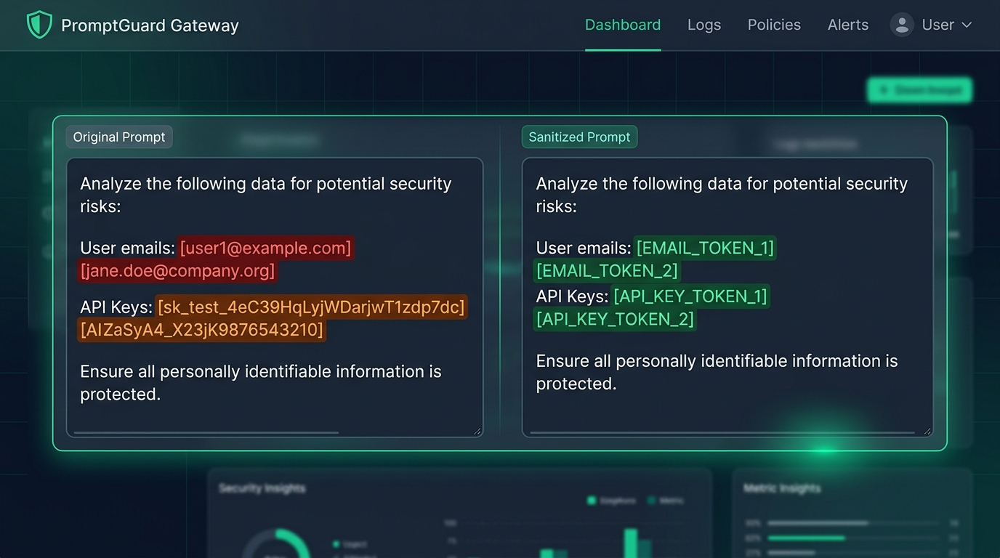
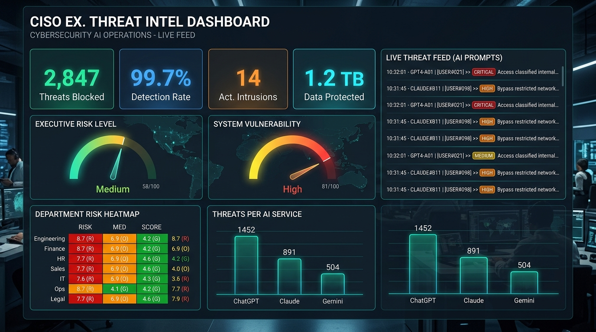
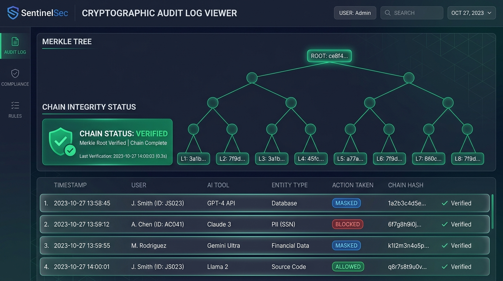
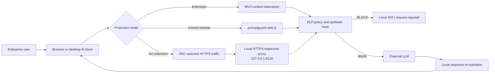

<div align="center">

<!-- Animated Header Banner -->


<br/>

<!-- Badges Row 1 -->
[](https://react.dev/)
[](https://www.typescriptlang.org/)
[](https://vitejs.dev/)
[](https://tailwindcss.com/)
[](https://developer.chrome.com/docs/extensions/mv3/intro/)

<!-- Badges Row 2 -->
[](https://opensource.org/licenses/MIT)
[](http://makeapullrequest.com)
[](https://github.com/gturkmenlabs/PromptGuard-Gateway)
[](https://www.docker.com/)

<br/>

<h3>🛡️ Enterprise Zero-Knowledge Data Loss Prevention & Security Gateway for Generative AI & LLMs</h3>

<p>
  <em>Intercept, anonymize, and cryptographically audit enterprise prompts in real-time<br/>before sensitive PII, PHI, API keys, credentials, or proprietary source code<br/>reach third-party AI models.</em>
</p>

<br/>

[**Live Demo**](#-quick-start-guide) · [**Documentation**](#-table-of-contents) · [**Report Bug**](https://github.com/gturkmenlabs/PromptGuard-Gateway/issues) · [**Request Feature**](https://github.com/gturkmenlabs/PromptGuard-Gateway/issues)

</div>


## 📑 Table of Contents

<details>
<summary><b>Click to expand navigation</b></summary>

&nbsp;

- [🌟 Overview](#-overview)
- [⚡ How It Works](#-how-it-works)
- [✨ Key Features](#-key-features)
- [📸 Screenshots](#-screenshots)
- [🏛️ Architecture & Data Flow](#️-architecture--data-flow)
- [🛡️ Supported Protection Categories](#️-supported-protection-categories)
- [🧩 Modules & Subsystems](#-modules--subsystems)
- [🔌 Chrome / Edge Extension](#-chrome--edge-extension)
- [🌐 Extension-Free HTTPS Protection](#-extension-free-https-protection)
- [✅ Verification & Troubleshooting](#-verification--troubleshooting)
- [🐳 Docker](#-docker)
- [🚀 Quick Start Guide](#-quick-start-guide)
- [🔒 Security & Compliance](#-security--compliance-principles)
- [🤝 Contributing](#-contributing)
- [📄 License](#-license)

</details>


## 🌟 Overview

As enterprises accelerate the adoption of Generative AI tools, employees inadvertently leak critical organizational assets:

<table>
<tr>
<td width="50%">

> **🔴 The Problem**
>
> Every day, employees paste sensitive data into AI chatbots:
> - 🔑 **API Keys & Secrets** — AWS, OpenAI, GitHub tokens
> - 👤 **Customer PII** — names, emails, SSNs, addresses
> - 🏥 **HIPAA/PHI** — patient records, diagnoses
> - 💳 **Financial Records** — credit cards, IBANs
> - 💻 **Source Code & IP** — proprietary algorithms

</td>
<td width="50%">

> **🟢 The Solution**
>
> PromptGuard Gateway intercepts prompts in real-time:
> - 🛡️ **Zero-Knowledge Masking** — synthetic token replacement
> - ⚡ **Sub-5ms Latency** — invisible to end users
> - 🔄 **Bi-Directional** — auto-restore in responses
> - 📜 **Merkle Audit** — tamper-proof compliance logs
> - 🚀 **3 Deployment Modes** — extension, proxy, SDK

</td>
</tr>
</table>

**PromptGuard Gateway** sits between enterprise users and external AI endpoints. It can run as a browser extension, an extension-free local HTTPS inspection proxy, an OpenAI-compatible API gateway, or an embeddable Web SDK.


## ⚡ How It Works

<!-- Animated Pipeline Diagram -->
<div align="center">

</div>

<br/>

<table>
<tr>
<td align="center" width="25%">
  <h4>1️⃣ Intercept</h4>
  <p><em>Capture raw enterprise prompts before they leave the browser</em></p>
</td>
<td align="center" width="25%">
  <h4>2️⃣ Analyze</h4>
  <p><em>DLP engine scans for PII, secrets, PHI, and source code</em></p>
</td>
<td align="center" width="25%">
  <h4>3️⃣ Sanitize</h4>
  <p><em>Replace sensitive entities with synthetic tokens</em></p>
</td>
<td align="center" width="25%">
  <h4>4️⃣ Restore</h4>
  <p><em>Re-hydrate tokens in the LLM response locally</em></p>
</td>
</tr>
</table>


## ✨ Key Features

<!-- Animated Features Grid -->
<div align="center">

</div>

<br/>

<details>
<summary><b>🔒 Zero-Knowledge Synthetic Vault</b> — Click to expand</summary>

&nbsp;

- **Context-Aware Replacement:** Replaces real names, emails, credit cards, and API keys with semantically valid synthetic data (e.g., `sk-live-...` → `synthetic-token-4912`).
- **Local-Only Vaulting:** Token mappings remain in volatile memory inside the browser or local daemon and are not written to audit logs.
- **Bi-Directional Re-hydration:** Automatically maps synthetic tokens back to original values in the corresponding LLM response.

</details>

<details>
<summary><b>⚡ Live Proxy Simulator</b> — Click to expand</summary>

&nbsp;

- Interactive real-time interceptor showing the 4-stage pipeline:
  1. **Raw Enterprise Prompt**
  2. **Entity Tokenization & Policy Engine**
  3. **Sanitized Synthetic Payload sent to LLM**
  4. **Unmasked Final Response**
- Live attack wave generator for red-team testing and CISO demonstrations.

</details>

<details>
<summary><b>📊 CISO Threat Intelligence & Risk Dashboard</b> — Click to expand</summary>

&nbsp;

- Real-time telemetry on intercepted leaks, high-risk departments, and top targeted AI services.
- Live attack and data-leak stream with instant enforcement actions (**Mask**, **Block**, **Hash**, **Log Only**).
- Departmental risk scoring (Engineering, HR, Finance, Legal, Customer Support).

</details>

<details>
<summary><b>📜 Merkle-Proof Cryptographic Audit Logs</b> — Click to expand</summary>

&nbsp;

- Tamper-evident, zero-knowledge audit trails for all prompt transactions.
- Every record is committed twice over: an append-only **hash chain** (`entryHash = SHA-256(prevHash ‖ leafHash)`) proves ordering, and a **Merkle tree** gives auditors an inclusion proof for a single record against the published root without exposing any other record.
- Hashing is real `SHA-256` via WebCrypto, with RFC 6962-style domain separation between leaves and inner nodes. Only the **digest** of a prompt is committed — never the prompt itself.
- The audit view recomputes the root and re-verifies the whole chain live; editing a committed record surfaces as `TAMPERING DETECTED at sequence #n`.

</details>

<details>
<summary><b>⚖️ Compliance & Governance Suite</b> — Click to expand</summary>

&nbsp;

- Automated compliance verification matrix for **SOC2 Type II**, **GDPR**, **HIPAA**, **ISO 27001**, and **PCI-DSS**.
- Printable auditor dossier quoting the ledger's live Merkle root, record count and chain status.
- Evidence exports: CSV audit trail (audit tab, includes prompt digests, chain hashes and the root) and JSON ledger export (extension popup).

</details>

<details>
<summary><b>🚀 Enterprise MDM & Zero-Touch Deployment</b> — Click to expand</summary>

&nbsp;

- Ready-to-deploy configuration profiles and deployment scripts:
  - **Microsoft Intune** (`.ps1` PowerShell enrollment)
  - **Jamf Pro** (`.mobileconfig` for macOS fleet)
  - **Windows Group Policy (GPO)** (`.admx` force-install policies)
  - **Enterprise PAC & Network Proxy** configurations

</details>

<details>
<summary><b>💰 Financial ROI & Breach Risk Calculator</b> — Click to expand</summary>

&nbsp;

- Interactive financial model calculating estimated breach avoidance savings, compliance penalty mitigation, and enterprise ROI based on organization headcount.

</details>


## 📸 Screenshots

<div align="center">

<table>
<tr>
<td align="center">
  
  <br/>
  <b>🔍 Live Proxy Simulator</b>
  <br/>
  <em>Real-time prompt interception and sanitization</em>
</td>
</tr>
<tr>
<td align="center">
  
  <br/>
  <b>📊 CISO Executive Dashboard</b>
  <br/>
  <em>Threat intelligence, risk metrics, and department analytics</em>
</td>
</tr>
<tr>
<td align="center">
  
  <br/>
  <b>📜 Cryptographic Audit Logs</b>
  <br/>
  <em>SHA-256 Merkle tree verification with tamper-proof chain</em>
</td>
</tr>
</table>

</div>


## 🏛️ Architecture & Data Flow

<!-- Animated Architecture Diagram -->
<div align="center">

</div>

<br/>

<details>
<summary><b>📐 View Mermaid Diagram</b></summary>

&nbsp;



</details>

The administration service on `127.0.0.1:9119` serves the health endpoint, PAC file, local CA certificate, Web SDK and production dashboard. The HTTPS inspection listener is separate and bound to loopback port `9120`.


## 🛡️ Supported Protection Categories

| Category | Detectable Entities | Default Action | Supported Regs |
| :--- | :--- | :---: | :--- |
| 🔑 **API Keys & Secrets** | AWS Keys, OpenAI/Anthropic/Google Keys, GitHub PATs, Private Keys, DB URIs | `BLOCK` | SOC2, ISO 27001 |
| 🎫 **Bearer Tokens** | JWTs, inline `password:` / `token=` assignments | `MASK` | SOC2, ISO 27001 |
| 👤 **Personal Data (PII)** | Names, Emails, Phone Numbers, SSNs, Physical Addresses | `SYNTHESIZE` | GDPR, CCPA |
| 💳 **Financial Info** | Credit Card Numbers (Luhn), IBANs, Bank Routing Codes | `MASK` | PCI-DSS |
| 🏥 **Healthcare (PHI)** | Patient IDs, Medical Record Numbers, Diagnosis Terms | `MASK` | HIPAA |
| 💻 **Source Code & IP** | Proprietary algorithms, Internal DB Schemas, Confidential URLs | `BLOCK / MASK` | Corporate IP |


## 🧩 Modules & Subsystems

```
PromptGuard-Gateway/
├── 📁 daemon/                     # Local admin service and HTTPS inspection proxy
│   ├── server.mjs                 # Ports 9119/9120, PAC, CA, scan and gateway APIs
│   └── 📁 installer/              # macOS, Windows and Linux installers
├── 📁 extension/                  # Chrome & Edge Manifest V3 Extension
│   ├── manifest.json              # Extension manifest & permissions
│   ├── promptguard-core.js        # Shared detection rules, masking & policy decisions
│   ├── content_script.js          # MAIN-world fetch/XHR proxy + on-page UI
│   ├── bridge.js                  # ISOLATED-world relay to the service worker
│   ├── background.js              # Hash-chained audit ledger (chrome.storage)
│   ├── popup.html                 # Extension quick-action control popup
│   └── popup.js                   # Ledger status, counters & auditor export
├── 📁 src/
│   ├── 📁 components/
│   │   ├── 📁 simulator/          # Live Proxy Interceptor & Sandbox
│   │   ├── 📁 dashboard/          # CISO Executive Threat Dashboard
│   │   ├── 📁 policies/           # Granular Policy Management Hub
│   │   ├── 📁 audit/              # Merkle-Proof Audit Log Viewer
│   │   ├── 📁 compliance/         # Regulatory Compliance Suite
│   │   ├── 📁 deployment/         # MDM / GPO Deployment Script Hub
│   │   ├── 📁 roi/                # ROI & Cost Avoidance Calculator
│   │   └── 📁 layout/             # Navigation & Header Components
│   ├── 📁 engine/
│   │   ├── tokenEngine.ts         # Regex & heuristic entity extractor
│   │   ├── syntheticVault.ts      # Contextual synthetic entity generator
│   │   └── cryptoAudit.ts         # SHA-256 hasher & Merkle proof builder
│   ├── 📁 data/                   # Initial security metrics & seed data
│   ├── 📁 types/                  # Core TypeScript types & interfaces
│   ├── App.tsx                    # Main gateway portal
│   └── main.tsx                   # React root entrypoint
├── 📁 public/
│   ├── promptguard-web.js         # Zero-extension SDK for websites you control
│   └── demo-chat.html             # OpenAI-compatible gateway demo
├── Dockerfile
└── docker-compose.yml
```


## 🔌 Chrome / Edge Extension

The project includes an **Enterprise Chrome & Edge Manifest V3 Extension** located in the [`/extension`](./extension) folder.

### 📥 Installing Extension in Developer Mode

<table>
<tr>
<td>

**Step 1**&nbsp;&nbsp;Open Chrome/Edge → `chrome://extensions/` or `edge://extensions/`

**Step 2**&nbsp;&nbsp;Toggle on **Developer mode** (top right corner)

**Step 3**&nbsp;&nbsp;Click **"Load unpacked"**

**Step 4**&nbsp;&nbsp;Select the `PromptGuard Gateway/extension` folder

**Step 5**&nbsp;&nbsp;The shield icon appears — sessions are now protected! 🛡️

</td>
</tr>
</table>

### 🔧 Enforcement Behaviour

| Behaviour | Description |
| :--- | :--- |
| 🔴 **Blocked** | Standing credentials (cloud/API keys, GitHub PATs, private keys, database URIs) — request rejected entirely, payload never reaches network |
| 🟡 **Masked** | PII, PHI, financial figures, proprietary code — replaced with synthetic tokens on the wire, re-hydrated in streamed response |
| 📜 **Audited** | Every intercept appends a SHA-256 digest record to the service-worker ledger; popup exports as JSON |


## 🌐 Extension-Free HTTPS Protection

PromptGuard can protect supported AI websites without modifying those websites and without installing a browser extension. The desktop daemon uses two local listeners:

| Listener | Purpose | Exposure |
| :--- | :--- | :--- |
| `127.0.0.1:9119` | Dashboard, health API, PAC file, CA download, Web SDK and OpenAI-compatible API | Loopback only by default |
| `127.0.0.1:9120` | HTTPS inspection proxy | Loopback only by default |

<details>
<summary><b>🌍 View All Supported AI Providers (25+)</b></summary>

&nbsp;

The default PAC configuration covers every model served through these provider families:

| Provider Group | Services |
| :--- | :--- |
| **Tier 1** | OpenAI/ChatGPT, Anthropic/Claude, Gemini/Vertex AI, Azure OpenAI |
| **Tier 2** | Amazon Bedrock, Microsoft Copilot, Mistral, Groq, Cohere |
| **Tier 3** | Perplexity, Together AI, OpenRouter, DeepSeek, xAI/Grok, Fireworks AI |
| **Tier 4** | Hugging Face, Replicate, Cerebras, DeepInfra |
| **Consumer** | Poe, Character.AI, Meta AI, Cursor |
| **Local** | Ollama (`11434`), LM Studio (`1234`) |

Protection is based on the request route, not the model name. For example, every current or future model selected through `api.openrouter.ai` is covered without adding its model ID.

</details>

### ➕ Add Any LLM Provider or Private Gateway

Append comma-separated domains with `PROMPTGUARD_DOMAINS`:

```bash
# Temporary/direct daemon launch
PROMPTGUARD_DOMAINS="llm.company.internal,*.models.example.com" \
  node daemon/server.mjs

# Persist on macOS or Linux by passing the setting to the installer
PROMPTGUARD_DOMAINS="llm.company.internal,*.models.example.com" \
  bash daemon/installer/install-macos.sh
```

<details>
<summary><b>🪟 Windows configuration</b></summary>

```powershell
setx PROMPTGUARD_DOMAINS "llm.company.internal,*.models.example.com"
daemon\installer\install-windows.bat
```

</details>

For additional local OpenAI-compatible servers:

```bash
PROMPTGUARD_LOCAL_LLM_PORTS="8080,5001" node daemon/server.mjs
```

> **Note:** Restart the daemon and browser after changing either setting. The active domain patterns and local ports are exposed by `/health` as `protectedDomains`, `customDomains` and `protectedLocalPorts`.

### 🖥️ Desktop Installation

```bash
npm install

# macOS
bash daemon/installer/install-macos.sh

# Linux
bash daemon/installer/install-linux.sh
```

On Windows, run `daemon\installer\install-windows.bat`. The installers:

1. 📋 Register the daemon to start with the user session
2. 🔐 Generate a device-local CA under `~/.promptguard/ca`
3. ✅ Add that CA to the platform trust store
4. 🌐 Enable `http://127.0.0.1:9119/proxy.pac` as the automatic proxy configuration

> ⚠️ **Important:** A PAC setting alone is not DLP inspection. HTTPS prompt bodies remain encrypted unless the device-local CA is explicitly trusted.


## ✅ Verification & Troubleshooting

### 🔍 Check Daemon and CA Readiness

```bash
curl http://127.0.0.1:9119/health
```

A ready installation returns:

```json
{
  "status": "active",
  "port": "9119",
  "proxyPort": 9120,
  "caReady": true,
  "mode": "https-inspection",
  "protectedDomainCount": 34,
  "customDomains": [],
  "protectedLocalPorts": ["11434", "1234"]
}
```

<details>
<summary><b>🛠️ Common Failure Modes & Solutions</b></summary>

&nbsp;

| Symptom | Likely Cause | Resolution |
| :--- | :--- | :--- |
| 🔴 Browser reports untrusted certificate | Local CA not trusted | Run platform installer again, restart browser |
| 🔴 `/health` does not respond | Daemon stopped or port `9119` occupied | Check service log, stop conflicting process |
| 🟡 Gemini logs `Header overflow` | Upstream Google response headers exceeded limit | Update/restart daemon (64 KiB limit) |
| 🟡 PAC works but prompts not counted | Browser cached old proxy settings | Restart browser, inspect `/proxy.pac` |
| 🟡 Pinned app refuses connections | Certificate pinning rejects inspection | Use API gateway or Web SDK |
| 🔴 Docker + desktop can't start together | Both try to bind ports 9119/9120 | Run only one deployment mode |

</details>

<details>
<summary><b>💬 ChatGPT Shows "Something went wrong"</b></summary>

&nbsp;

1. Confirm both ports are listening and `/health` reports `caReady: true`
2. Restart the daemon:
   ```bash
   launchctl kickstart -k gui/$(id -u)/io.promptguard.gateway
   ```
3. Reload ChatGPT with `Cmd + Shift + R`, or fully quit and reopen the browser
4. Inspect `/tmp/promptguard-daemon.err` for new errors

</details>


## 🐳 Docker

Build and start the production dashboard, API and HTTPS proxy:

```bash
# Build and start
docker compose up -d --build

# View logs
docker compose logs -f

# Stop
docker compose down
```

> Compose publishes both ports on `127.0.0.1` and persists the generated CA in the `promptguard-ca` volume. Do not run the Docker deployment at the same time as the desktop LaunchAgent/systemd service.


## 🚀 Quick Start Guide

### Prerequisites

| Requirement | Version |
| :--- | :--- |
| **Node.js** | v18.0.0 or higher |
| **npm** / **pnpm** / **yarn** | Any recent version |

### ⚡ Get Running in 60 Seconds

```bash
# 1. Clone the repository
git clone https://github.com/gturkmenlabs/PromptGuard-Gateway.git
cd PromptGuard-Gateway

# 2. Install dependencies
npm install

# 3. Start the frontend development server
npm run dev

# 4. (Optional) Start the local gateway and HTTPS proxy
node daemon/server.mjs

# 5. Build for production
npm run build
```


## 🔒 Security & Compliance Principles

<table>
<tr>
<td align="center" width="33%">
  <h4>🚫 Zero-Storage</h4>
  <p>Raw prompts containing clear-text credentials or PII are <b>never persisted</b> to disk or cloud logs</p>
</td>
<td align="center" width="33%">
  <h4>🔐 Client-Side Crypto</h4>
  <p>Audit logs store only cryptographic nonces and <b>SHA-256</b> hashes for non-repudiation</p>
</td>
<td align="center" width="33%">
  <h4>🛑 Fail-Secure</h4>
  <p>If the gateway loses connectivity, it defaults to <b>blocking high-risk</b> payloads</p>
</td>
</tr>
</table>


## 🤝 Contributing

Contributions, bug reports, and feature requests are welcome!

```bash
# 1. Fork the repository
# 2. Create your feature branch
git checkout -b feature/AmazingFeature

# 3. Commit your changes
git commit -m 'feat: Add some AmazingFeature'

# 4. Push to the branch
git push origin feature/AmazingFeature

# 5. Open a Pull Request
```


## 📄 License

This project is licensed under the **MIT License**. See the [LICENSE](./LICENSE) file for details.

<br/>

<!-- Animated Footer -->
<div align="center">

</div>
